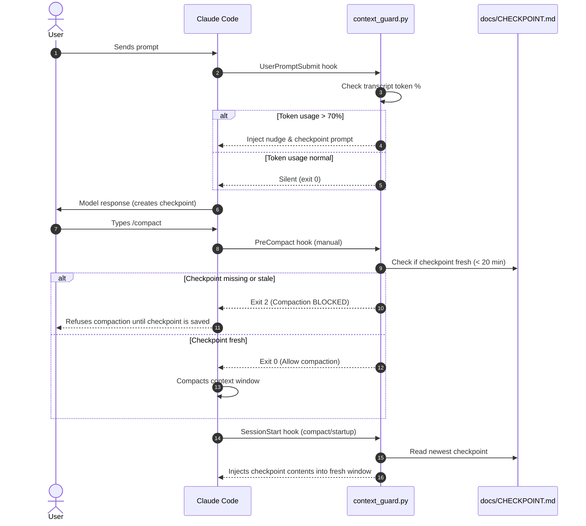

# Chapter 3: Hooks & Context Guards

[← Back to User Manual](README.md) · [← Previous: Skills Catalog](02-skills-catalog.md) · [Next: Workflows & Recipes →](04-workflows-and-recipes.md)

This chapter explains the **context-guard** and **git pre-commit** hooks included with `swe-skills`. All hooks are **opt-in** and do nothing until explicitly installed.

---

## Why Context Guards Matter

AI coding agents are notoriously poor at monitoring their own context usage. When context approaches 100%:
1. Early instructions, user decisions, and boundary constraints are silently forgotten.
2. In-place auto-compaction summarizes history lossily, often dropping uncommitted changes, dead ends, or active debugging hypotheses.
3. Agents frequently trigger manual `/compact` commands without writing a persistent checkpoint first, leading to catastrophic context amnesia.

The `swe-skills` context-guard hooks shift monitoring out of the agent's internal reasoning loop and into the harness lifecycle.

---

## Lifecycle Event Matrix

| Hook Name | Harness Event | Target Harness | Action & Behavior |
|---|---|---|---|
| `nudge` | `UserPromptSubmit` | Claude Code | Reads token usage from the transcript. Above 70% (default), injects an instruction reminding the agent to checkpoint to disk while there is still room, and gives the user a tailored `/compact` command. Re-fires every +10%. |
| `preinvocation` | `PreInvocation` | Antigravity (`agy`) | Runs before each model invocation. When session steps (default 50) or transcript size (default 500 KB) exceed limits, injects an ephemeral message directing the agent to write a checkpoint and advise the user to start a fresh chat (`/exit` or New Chat). Re-fires every +15 steps. |
| `precompact` | `PreCompact` | Claude Code | On **manual** `/compact`, verifies whether a fresh checkpoint was touched in the last 20 minutes. If absent, exits with code 2 to **block compaction** until the agent saves state. On **auto-compaction**, it never blocks (to avoid stalling a full window). |
| `sessionstart` | `SessionStart` | Claude Code / Antigravity | Injects the newest checkpoint file into the resumed session along with continuity verification instructions. If no checkpoint exists, instructs the agent to ask the user rather than guess past state. |
| `pre-commit` | Git `pre-commit` | Git / All Harnesses | Scans staged files before `git commit` to block absolute machine home paths, unmasked credentials, manifest version mismatches, and skill linter errors. |

---

## Claude Code Hooks Lifecycle



---

## Antigravity (`agy`) Hooks Lifecycle

Antigravity operates without an in-place `/compact` command. Reducing context requires saving state and opening a fresh chat:

1. **PreInvocation:** `context_guard.py preinvocation` inspects incoming payload fields (`initialNumSteps`, `transcriptPath`).
2. **Threshold Trigger:** When step count exceeds `SWE_SKILLS_AGY_STEP_LIMIT` (default 50) or transcript size exceeds `SWE_SKILLS_AGY_BYTES_LIMIT` (default 500 KB), it outputs:
   ```json
   {
     "injectSteps": [
       {
         "ephemeralMessage": "[context guard] Session step count is high (55 steps). To maintain fast responses and prevent reasoning degradation, load the `compacting-context-safely` skill: reach a stable point, write or refresh a checkpoint... Once checkpointed, advise the user to start a fresh session (/exit, Ctrl+D, or New Chat) to resume from the checkpoint."
       }
     ]
   }
   ```
3. **Throttling:** Prevents repetitive nagging by silencing triggers until another `SWE_SKILLS_AGY_STEP_STEP` (default 15) steps have elapsed.
4. **SessionStart:** When the user launches a fresh chat, `SessionStart` immediately re-reads `docs/CHECKPOINT.md` and restores context continuity.

---

## Git Pre-Commit Security & Portability Gate

The pre-commit guard [`scripts/hooks/git_pre_commit.py`](../../scripts/hooks/git_pre_commit.py) validates four essential invariants before allowing any commit:

1. **Absolute Home Paths:** Rejects any staged file containing hardcoded machine home paths (`$HOME` or user directory paths), enforcing portability (`keeping-repos-portable`).
2. **Secret & Key Leakage:** Rejects unmasked private keys (`BEGIN PRIVATE KEY`), AWS/GitHub API tokens, and secret patterns.
3. **Manifest Version Parity:** Verifies that version strings match exactly across `plugin.json`, `.claude-plugin/plugin.json`, `.cursor-plugin/plugin.json`, and `.claude-plugin/marketplace.json`.
4. **Skill Linter Compliance:** Executes `lint-skills.py` to ensure all 50 skills pass frontmatter and word count validation.

---

## Configuration Reference & Environment Variables

All settings can be customized via environment variables:

| Variable | Default | Purpose |
|---|---|---|
| `SWE_SKILLS_CONTEXT_LIMIT` | `200000` | Context window size in tokens for percentage calculations. |
| `SWE_SKILLS_CONTEXT_PCT` | `70` | Transcript percentage at which the initial nudge fires. |
| `SWE_SKILLS_CONTEXT_PCT_STEP` | `10` | Frequency of follow-up nudges (+N% used). |
| `SWE_SKILLS_AGY_STEP_LIMIT` | `50` | Step count threshold for Antigravity PreInvocation nudge. |
| `SWE_SKILLS_AGY_STEP_STEP` | `15` | Re-nudge interval in steps for Antigravity. |
| `SWE_SKILLS_AGY_BYTES_LIMIT` | `500000` | Transcript byte size threshold for Antigravity PreInvocation nudge. |
| `SWE_SKILLS_CONTEXT_GUARD_BLOCK` | `1` | Set to `0` to allow unverified manual `/compact` commands. |
| `SWE_SKILLS_CHECKPOINT_FRESH_MINUTES` | `20` | Maximum age of a checkpoint accepted by PreCompact. |
| `SWE_SKILLS_CHECKPOINT_FRESH_HOURS` | `12` | Maximum age of a checkpoint injected at fresh session startup. |
| `SWE_SKILLS_CHECKPOINT_GLOBS` | *see below* | `:`-separated globs to discover checkpoints relative to repo root. |
| `SWE_SKILLS_CONTEXT_GUARD_DEBUG` | `0` | Set to `1` to output diagnostic logging to stderr. |

Default checkpoint discovery globs:
`docs/plans/*checkpoint*.md`, `docs/checkpoints/*.md`, `docs/CHECKPOINT.md`, `CHECKPOINT.md`, `.claude/checkpoints/*.md`.

---

## Debugging & Diagnostics (`report` command)

To inspect current context utilization and the active checkpoint without firing a hook:

```bash
python3 scripts/hooks/context_guard.py report
```

Example output:
```text
context: 142100 tokens, 71% of 200000
newest checkpoint: docs/CHECKPOINT.md (modified 4.2m ago)
```
