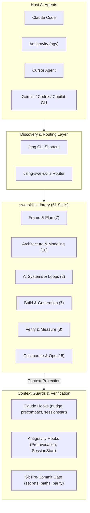

# swe-skills User Manual

[← Back to Repository README](../../README.md)

Welcome to the comprehensive user manual for **`swe-skills`**, a modular suite of 51 software engineering, planning, architecture, and operational skills designed for AI coding agents (**Claude Code**, **Antigravity (`agy`)**, **Cursor**, and any agent consuming `~/.agents/skills`).

```text
╔══════════════════════════════════════════════════════════════════════════════╗
║                                                                              ║
║  ███████╗██╗    ██╗███████╗    ███████╗██╗  ██╗██╗██╗     ██╗     ███████╗   ║
║  ██╔════╝██║    ██║██╔════╝    ██╔════╝██║ ██╔╝██║██║     ██║     ██╔════╝   ║
║  ███████╗██║ █╗ ██║█████╗█████╗███████╗█████╔╝ ██║██║     ██║     ███████╗   ║
║  ╚════██║██║███╗██║██╔══╝╚════╝╚════██║██╔═██╗ ██║██║     ██║     ╚════██║   ║
║  ███████║╚███╔███╔╝███████╗    ███████║██║  ██╗██║███████╗███████╗███████║   ║
║  ╚══════╝ ╚══╝╚══╝ ╚══════╝    ╚══════╝╚═╝  ╚═╝╚═╝╚══════╝╚══════╝╚══════╝   ║
║                                                                              ║
║           SOFTWARE ENGINEERING & ARCHITECTURE SKILLS FOR AI AGENTS           ║
║                 Claude Code  •  Antigravity (agy)  •  Cursor                 ║
║                                                                              ║
╚══════════════════════════════════════════════════════════════════════════════╝
```

---

## Architecture Overview



---

## Table of Contents

1. [Chapter 1: Getting Started](01-getting-started.md)
   - [Prerequisites & System Requirements](01-getting-started.md#prerequisites--system-requirements)
   - [Global Installation Across Runtimes](01-getting-started.md#global-installation-across-runtimes)
   - [Claude Code Setup](01-getting-started.md#claude-code-setup)
   - [Antigravity (`agy`) Setup](01-getting-started.md#antigravity-agy-setup)
   - [Cursor Setup](01-getting-started.md#cursor-setup)
   - [Project-Level Setup](01-getting-started.md#project-level-setup)
   - [Two-Minute First Verification](01-getting-started.md#two-minute-first-verification)

2. [Chapter 2: Skills Catalog & Classification](02-skills-catalog.md)
   - [Skill Classification & Design Philosophy](02-skills-catalog.md#skill-classification--design-philosophy)
   - [Entry & Routing](02-skills-catalog.md#entry--routing)
   - [Frame & Plan](02-skills-catalog.md#frame--plan)
   - [Architecture & Modeling](02-skills-catalog.md#architecture--modeling)
   - [AI Systems & Unattended Loops](02-skills-catalog.md#ai-systems--unattended-loops)
   - [Build & Code Generation](02-skills-catalog.md#build--code-generation)
   - [Verify, Measure & Quality](02-skills-catalog.md#verify-measure--quality)
   - [Collaborate, Sustain & Operations](02-skills-catalog.md#collaborate-sustain--operations)

3. [Chapter 3: Hooks & Context Guards](03-hooks-and-context-guards.md)
   - [Why Context Guards Matter](03-hooks-and-context-guards.md#why-context-guards-matter)
   - [Claude Code Hooks Lifecycle](03-hooks-and-context-guards.md#claude-code-hooks-lifecycle)
   - [Antigravity (`agy`) Hooks Lifecycle](03-hooks-and-context-guards.md#antigravity-agy-hooks-lifecycle)
   - [Git Pre-Commit Security & Portability Gate](03-hooks-and-context-guards.md#git-pre-commit-security--portability-gate)
   - [Configuration Reference & Environment Variables](03-hooks-and-context-guards.md#configuration-reference--environment-variables)
   - [Debugging & Diagnostics (`report` command)](03-hooks-and-context-guards.md#debugging--diagnostics-report-command)

4. [Chapter 4: Workflows & Practical Recipes](04-workflows-and-recipes.md)
   - [Recipe 1: Scaffolding a New Project with Contracts](04-workflows-and-recipes.md#recipe-1-scaffolding-a-new-project-with-contracts)
   - [Recipe 2: Hunting Silent Failures in Unfamiliar Code](04-workflows-and-recipes.md#recipe-2-hunting-silent-failures-in-unfamiliar-code)
   - [Recipe 3: Executing Safe Architectural Refactoring](04-workflows-and-recipes.md#recipe-3-executing-safe-architectural-refactoring)
   - [Recipe 4: Multi-Lens Pre-Release Auditing](04-workflows-and-recipes.md#recipe-4-multi-lens-pre-release-auditing)
   - [Recipe 5: Context Compaction and Clean Session Handoffs](04-workflows-and-recipes.md#recipe-5-context-compaction-and-clean-session-handoffs)
   - [Recipe 6: Automated SemVer Versioning and Release](04-workflows-and-recipes.md#recipe-6-automated-semver-versioning-and-release)
   - [Recipe 7: Adaptive Model Dispatch & Test-Time Compute Optimization](04-workflows-and-recipes.md#recipe-7-adaptive-model-dispatch--test-time-compute-optimization)

5. [Chapter 5: Authoring & Extending Skills](05-authoring-skills.md)
   - [Skill Specification & Frontmatter Standard](05-authoring-skills.md#skill-specification--frontmatter-standard)
   - [Word Budgets and Reference Splitting](05-authoring-skills.md#word-budgets-and-reference-splitting)
   - [Step-by-Step Guide to Adding a Skill](05-authoring-skills.md#step-by-step-guide-to-adding-a-skill)
   - [Validation Gates & Skill Linter](05-authoring-skills.md#validation-gates--skill-linter)
   - [Pressure-Testing with Scenarios](05-authoring-skills.md#pressure-testing-with-scenarios)

6. [Chapter 6: CLI & Script Reference](06-reference-and-cli.md)
   - [`scripts/install.sh`](06-reference-and-cli.md#scriptsinstallsh)
   - [`scripts/lint-skills.py`](06-reference-and-cli.md#scriptslint-skillspy)
   - [`scripts/hooks/install-hooks.py`](06-reference-and-cli.md#scriptshooksinstall-hookspy)
   - [`scripts/hooks/context_guard.py`](06-reference-and-cli.md#scriptshookscontext_guardpy)
   - [`scripts/hooks/git_pre_commit.py`](06-reference-and-cli.md#scriptshooksgit_pre_commitpy)
   - [`scripts/eval-router.py`](06-reference-and-cli.md#scriptseval-routerpy)
   - [`scripts/run-scenarios.py`](06-reference-and-cli.md#scriptsrun-scenariospy)
   - [`skills/release/scripts/release.sh`](06-reference-and-cli.md#skillsreleasescriptsreleasesh)

7. [Chapter 7: Troubleshooting & FAQ](07-troubleshooting-and-faq.md)
   - [Agent Over-Discovery / Loading Too Many Skills](07-troubleshooting-and-faq.md#agent-over-discovery--loading-too-many-skills)
   - [Compaction Blocked or Stalled](07-troubleshooting-and-faq.md#compaction-blocked-or-stalled)
   - [Antigravity Plugin Not Registering Hooks](07-troubleshooting-and-faq.md#antigravity-plugin-not-registering-hooks)
   - [Pre-Commit Hook Rejections](07-troubleshooting-and-faq.md#pre-commit-hook-rejections)
   - [Symlinks vs Standalone Copies](07-troubleshooting-and-faq.md#symlinks-vs-standalone-copies)
   - [Frequently Asked Questions](07-troubleshooting-and-faq.md#frequently-asked-questions)
