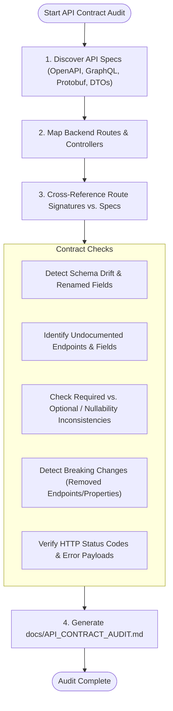

# API Contract & Schema Drift Audit Skill (`api-contract-audit`)

An agent skill to verify that API specifications (OpenAPI, Swagger, GraphQL schemas, Protobufs, TypeScript DTOs, Pydantic models) remain in 100% sync with actual route handlers and database models across your codebase.

---

## Agent Detection & Mode Tuning

| Agent / Environment | Audit Mechanism |
| :--- | :--- |
| **Antigravity (`agy`)** | Locates schema files via `find_by_name`, searches route controllers with `grep_search`, compares payload interfaces, and outputs structured audit artifacts. |
| **Claude Code** | Parses `$ARGUMENTS` (e.g. `/api-contract-audit`, `/api-contract-audit openapi.yaml`), conducts diff analysis between spec files and controller signatures. |
| **Cursor (Composer / Agent)** | Examines routes and DTO files, providing targeted schema synchronizations directly in workspace files. |
| **Universal AI Agents** | Standard regex and AST comparison between route handlers and contract specifications. |

---

## Audit Workflow Pipeline



---

## Step 1: Discover API Specs & DTOs

Search the repository for schema definitions:

```bash
# OpenAPI / Swagger
find . -name "*openapi*.yaml" -o -name "*openapi*.json" -o -name "*swagger*.yaml" -o -name "*swagger*.json" 2>/dev/null

# GraphQL
find . -name "*.graphql" -o -name "*.gql" 2>/dev/null

# Protobuf / gRPC
find . -name "*.proto" 2>/dev/null

# TypeScript / Python DTOs & Models
find . -path "*/dto/*" -o -path "*/schemas/*" -o -path "*/models/*" 2>/dev/null
```

---

## Step 2: Cross-Reference Handlers with Specs

For every route handler / controller in the application:

1. **Path & Verb Match**: Does `POST /api/v1/orders` exist in the spec? Is the HTTP verb correct?
2. **Request Body DTO**: Do incoming payload fields in the spec match the controller's validator (e.g., Zod, Pydantic, Joi, class-validator)?
3. **Response Schema**: Does the returned JSON payload match the 200/201 response schema definition?
4. **Status Codes**: Are error responses (400, 401, 403, 404, 422, 500) documented in the spec?

---

## Step 3: Drift & Violation Classifications

| Severity | Drift Type | Example | Impact |
| :--- | :--- | :--- | :--- |
| **🚨 CRITICAL** | Breaking Change | Field `userId` removed or changed from `string` to `number`. | Breaks existing mobile apps or API clients. |
| **⚠️ HIGH** | Undocumented Field | Controller returns `isAdmin` or `stripeCustomerId` omitted from spec. | Leaks sensitive internal data or causes client parse errors. |
| **⚡ MEDIUM** | Nullability Mismatch | Field marked non-nullable in spec, but database returns `null`. | Client runtime crash (`TypeError: Cannot read properties of null`). |
| **ℹ️ LOW** | Missing Error Code | Controller returns 422 Unprocessable Entity, but spec only lists 400. | Client error handlers fail to display specialized UX. |

---

## Step 4: Generate Improvement Report

Save results to `docs/API_CONTRACT_AUDIT.md`:

```markdown
# API Contract & Schema Drift Audit Report

**Date:** `[YYYY-MM-DD]`  
**Audited Specs:** `openapi.yaml`, `src/routes/*`  
**Total Endpoints Audited:** `[XX]`  
**Contract Sync Grade:** `[A / B / C / D / F]`

---

## 1. 🚨 Breaking Contract Changes
- **Endpoint:** `GET /api/v1/users/:id`
  - **Issue:** Spec defines property `avatar_url`, but controller now returns `profileImageUrl`.
  - **Remediation:** Add backward-compatible alias or update API version.

## 2. ⚠️ Schema Drift & Undocumented Properties
- **Endpoint:** `POST /api/v1/checkout`
  - **Issue:** Controller accepts `discountCode` which is missing from OpenAPI request body schema.

## 3. ⚡ Nullability & Type Inconsistencies
- **Model:** `UserProfile`
  - **Issue:** `bio` is marked `required` in schema, but nullable in PostgreSQL model.
```

---

## Anti-Patterns to Avoid

1. **Do not trust outdated documentation**: Always verify specs against actual runtime controller code.
2. **Never ignore error response schemas**: Structured error objects (`{ code, message, details }`) must be typed and audited just like success responses.
3. **Prevent accidental data leakage**: Verify that internal database entity fields (passwords, salt, internal flags) never appear in public DTOs.
