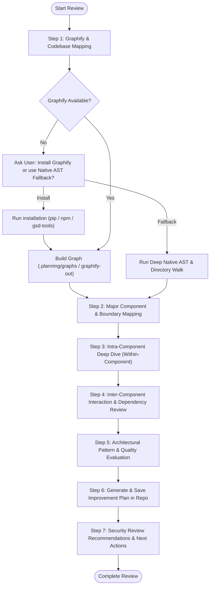

# Code & Architecture Review Skill

An exhaustive, agent-optimized framework for analyzing software architecture, component cohesion, inter-module coupling, code quality, and engineering trade-offs across any codebase.

---

## Agent Detection & Mode Tuning

Before beginning, identify the active runtime environment to use the optimal tools and output mechanisms:

| Agent / Environment | Primary Capabilities & Output Mechanism |
| :--- | :--- |
| **Antigravity (`agy`)** | Use native file & search tools (`view_file`, `grep_search`, `find_by_name`). Create interactive user artifacts with `write_to_file` (with `ArtifactMetadata`). Support subagent delegation (`research`, `self`) for large repos. Render Mermaid diagrams natively. |
| **Claude Code** | Use `Read`, `Grep`, `Glob`, and inline `Bash`. Utilize `$ARGUMENTS` parsing if invoked via slash command `/code-architecture-review`. Stream output concisely. |
| **Cursor (Composer / Agent)** | Reference codebase indexing (`@codebase`, `@workspace`), execute terminal commands via terminal tool, generate clean markdown plans suitable for Composer multi-file editing. |
| **Universal / CLI Agents** | Use standard POSIX file inspection, ripgrep (`rg`), AST extractors, and markdown files stored in the repository root or `.planning/` directory. |

---

## Workflow Overview



---

## Step 1: Codebase Mapping & Graphify Gate

Knowledge graphs and structural call graphs dramatically increase review accuracy by capturing topological dependencies and blast radius.

### 1.1 Check for Graphify / Knowledge Graph Tooling

Check if `graphify` or `@opengsd/gsd-core` graphify is available:

```bash
# Check CLI availability
command -v graphify >/dev/null 2>&1 || command -v gsd-tools >/dev/null 2>&1 || [ -f "$HOME/.gemini/antigravity/gsd-core/bin/gsd-tools.cjs" ]
```

### 1.2 User Interaction Gate: Option to Install Graphify

If `graphify` is **not installed** or not configured:
- **Prompt the user explicitly** asking if they wish to install `graphify` for automated visual graph generation, or proceed with native repository AST/file scanning.

> **User Prompt Template:**
> *"Would you like to install `graphify` for automated dependency graph generation and visual AST mapping?*
> 1. **Yes, install Graphify** (via `pip install graphify-cli` or `npx @opengsd/gsd-core`)
> 2. **No, proceed with native AST & deep static code analysis** (zero installation overhead)*"

#### If User Selects Option 1 (Install):
Run the appropriate package manager:
```bash
# Python-based Graphify CLI
uv tool install graphify-cli 2>/dev/null || pip install graphify-cli 2>/dev/null

# Or GSD Graphify Core
npx -y @opengsd/gsd-core@latest --local 2>/dev/null || true
```
Then execute graph generation:
```bash
graphify update . || (node gsd-core/bin/gsd-tools.cjs graphify build 2>/dev/null) || true
```

#### If User Selects Option 2 (Native Fallback) or Graphify is Skipped:
Perform a deep static structure scan:
1. Map repository layout, entry points, module boundaries, configuration files, and package manifests (`package.json`, `pyproject.toml`, `Cargo.toml`, `go.mod`, `pom.xml`, `build.gradle`, `CMakeLists.txt`).
2. Identify top directories, source files, and import hierarchies using ripgrep / regex pattern matching.

---

## Step 2: Major Component & Domain Mapping

Identify and catalog the top-level architectural building blocks:

1. **System Entry Points**:
   - HTTP/REST/GraphQL APIs, CLI entrypoints, background workers, event consumers, UI bootstrapper.
2. **Domain & Business Logic Core**:
   - Services, domain models, business rule validators, state machines, use cases.
3. **Data Access & Storage Layer**:
   - ORM schemas, query builders, repository abstractions, caching layers (Redis/Memcached), database migrations.
4. **External Integrations & Infrastructure**:
   - Third-party SDKs, cloud provider clients, messaging queues (Kafka/RabbitMQ/SQS), file storage.
5. **Cross-Cutting Concerns**:
   - Authentication/Authorization, telemetry/logging, error handling middleware, configuration management, utility libraries.

Generate a Mermaid component diagram showing the top-level topology.

---

## Step 3: Intra-Component Deep Dive (Within-Component Review)

Examine individual modules in isolation. For each major component, evaluate:

1. **Cohesion & Single Responsibility Principle (SRP)**:
   - Does each file/class have a single, well-defined reason to change?
   - Are there "God objects", mega-functions (>100 lines), or grab-bag `utils`/`helpers` files?
2. **Type Safety & Data Contracts**:
   - Are types strictly defined, or are there untyped payloads (`any`, `dict`, `interface{}`)?
   - Are boundary inputs validated (e.g., Zod, Pydantic, Marshmallow, type guards)?
3. **Error Handling & Resilience**:
   - Are errors caught and re-thrown with context, or swallowed silently (`catch (e) {}` / `except: pass`)?
   - Are unexpected exceptions surfaced with structured observability?
4. **State & Concurrency Management**:
   - Are components mutating global state?
   - Are concurrent operations thread-safe or race-condition-free?
5. **Testability & Determinism**:
   - Can business logic be tested without spinning up databases or external networks?
   - Are dependencies injected or hardcoded inside constructors?

---

## Step 4: Inter-Component & Cross-Module Review

Analyze how modules interface with one another across boundaries:

1. **Coupling & Dependency Direction**:
   - Does dependency flow inward toward high-level business logic (Clean / Hexagonal architecture)?
   - Are there cyclic dependencies between modules (`A -> B -> A`)?
2. **Interface Abstraction & Leaky Abstractions**:
   - Do callers depend on abstractions/interfaces or concrete implementations?
   - Do database/storage entities leak directly into API responses or UI layers?
3. **Data Flow & Communication Patterns**:
   - Is communication synchronous (tightly coupled HTTP/RPC) vs. asynchronous (events/pub-sub)?
   - Are there N+1 query patterns or inefficient cascading cross-module calls?
4. **Shared State & Side Effects**:
   - Are components communicating via hidden side effects or shared mutable memory?
   - Is there clear ownership of lifecycle and resource cleanup?

---

## Step 5: Architectural Pattern & Quality Evaluation

Benchmark the system against established architectural standards:

| Dimension | Evaluation Criteria | Common Red Flags |
| :--- | :--- | :--- |
| **Layering & Boundaries** | Clear separation between presentation, application, domain, and data layers. | Controller executing raw SQL; UI directly mutating data models. |
| **Extensibility (OCP)** | Adding new features requires adding code, not modifying core algorithms. | Giant `switch-case` statements across multiple files for every new variant. |
| **Scalability & Performance** | Asymptotic complexity, memory allocation patterns, batching, caching. | Unindexed database queries; in-memory unbounded array growth. |
| **Maintainability Index** | Code complexity (cyclomatic/cognitive), duplication (DRY), naming conventions. | Deeply nested conditionals (>4 levels); copy-pasted boilerplate blocks. |

---

## Step 6: Generate & Save Improvement Plan in Repo

Always write the comprehensive review and actionable roadmap into the repository.

### Default Destination Paths
- **Primary**: `docs/ARCHITECTURE_REVIEW.md` (or `ARCHITECTURE_REVIEW.md` at root if `docs/` is absent)
- **GSD/Planning Projects**: `.planning/reviews/ARCHITECTURE_REVIEW_PLAN.md`

### Required Structure of the Improvement Plan

The saved document **must** include the following five mandatory sections:

```markdown
# Comprehensive Architecture & Code Review Improvement Plan

**Target Repository:** `<Repo Name / Path>`
**Date:** `<YYYY-MM-DD>`
**Reviewers:** `<Agent Model / Review Suite>`
**Overall Health Grade:** `<A / B / C / D / F>`

---

## 1. Code Architecture
- **Executive Architecture Summary**: High-level paradigm (Monolith, Modular Monolith, Microservices, Event-Driven, CLI, etc.).
- **Current System Diagram**: Mermaid diagram of components and data flows.
- **Target State Architecture**: Visual blueprint of the recommended architectural evolution.
- **Architectural Debt & Trade-offs**: Intentional vs. accidental complexity.

---

## 2. Code Module & Component Review
- **Component Breakdown**: Detailed scorecard for each major module.
- **Intra-Module Findings**:
  - Strengths & positive design decisions
  - High-complexity hotspots (functions/files needing refactoring)
  - Code smell catalog (SRP violations, large classes, dead code)
  - Type-safety and error-handling evaluation

---

## 3. Code Inter-Module Review
- **Inter-Component Relationship Graph**: Cross-boundary dependencies.
- **Coupling & Cohesion Analysis**: Afferent/efferent coupling assessment.
- **Dependency Flow & Circularity**: Identification of any cycle risks or inverted dependencies.
- **Interface & Boundary Quality**: Evaluation of APIs, DTOs, and encapsulation integrity.

---

## 4. Recommended Improvements (Prioritized Roadmap)
- **Phase P0: Critical Architectural & Stability Fixes** (Immediate risk / blocking issues)
- **Phase P1: High-Impact Modular Refactoring** (Decoupling, abstraction layers, core performance)
- **Phase P2: Code Quality & Maintainability Polish** (DRY cleanups, type tightening, testability)
- **Phase P3: Future-Proofing & Extensibility** (Long-term architecture alignment)
- *Include concrete "Before vs. After" code transformation examples for top recommendations.*

---

## 5. Security & Robustness Recommendations
- **Surface Vulnerability Analysis**: Attack surface assessment, input validation, authentication/authorization boundaries.
- **Secrets & Configuration Handling**: Hardcoded credentials check, environment isolation.
- **Dependency & Supply Chain Risks**: Outdated packages or known CVE exposure.
- **Recommended Security Next Step**: Suggest running dedicated tools (e.g. `/security-scan`, `/security-evaluate`, or `npm audit` / `bandit` / `cargo audit` / `trivy`).
```

---

## Step 7: Security Review Suggestion & Next Action Guidance

Conclude every review with actionable next steps for the user:
1. Offer to start executing **Phase P0 / P1** refactoring immediately.
2. Suggest running a dedicated security scan (e.g., `/security-scan` or `/security-evaluate`).
3. Offer to break down the improvement plan into actionable implementation tasks or a formal roadmap (`/plan` or `/gsd-plan-phase`).

---

## Agent-Specific Tuning & Integration

### For Claude Code
- Parse `$ARGUMENTS` to support scoped reviews:
  - `/code-architecture-review` (Full repo scan)
  - `/code-architecture-review src/components` (Subsystem scoped review)
- Leverage sub-commands or parallel reads for fast AST traversal.
- Commit the review report cleanly if requested by the user.

### For Antigravity (`agy`)
- Utilize `write_to_file` with `ArtifactMetadata` for interactive review inspection.
- Embed interactive Mermaid graphs directly in output artifacts.
- Suggest built-in slash commands in chat:
  - *"You can use `/plan` to convert this improvement plan into a structured milestone roadmap."*
  - *"You can run `/security-scan` to perform an in-depth OWASP & CVE audit."*
- If the repository is very large, invoke a `research` subagent to concurrently survey subsystem directories.

### For Cursor
- Guide the user to reference `@docs/ARCHITECTURE_REVIEW.md` in Composer when initiating refactoring.
- Provide targeted file edit instructions matching Cursor's multi-file inline diff engine.
- Generate `.cursor/rules/architecture-rules.mdc` if the user wants to enforce the newly defined architectural boundaries continuously during development.

---

## Review Anti-Patterns to Avoid

1. **Do NOT produce superficial style critiques**: Focus on structure, architecture, design patterns, separation of concerns, and system durability—not just formatting or lint trivialities.
2. **Do NOT skip the user confirmation for tooling**: Always ask before running network/package installations (`pip`, `npm`).
3. **Do NOT leave the plan purely theoretical**: Provide concrete code snippets illustrating the recommended pattern transitions (e.g. converting a switch-statement monolith into a strategy or factory pattern).
4. **Do NOT overwrite existing architecture documents without checking**: Save to `docs/ARCHITECTURE_REVIEW.md` or a new versioned file if one already exists.
