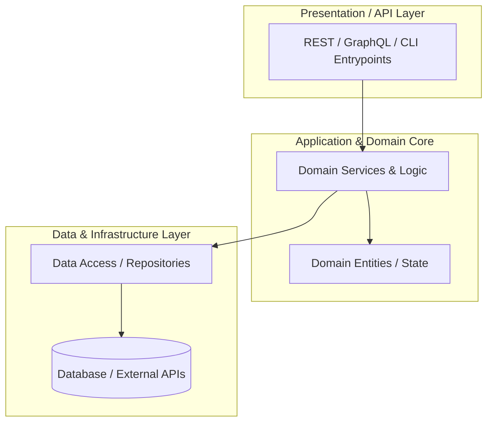
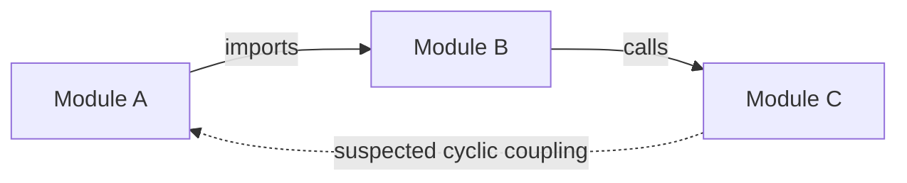

# Architecture & Code Review Improvement Plan: [Project Name]

> **Repository:** `[Repo Name / Path]`  
> **Date:** `[YYYY-MM-DD]`  
> **Review Scope:** `[Full Repository / Subsystem]`  
> **Reviewer:** `[Agent Name / Model / Review Framework]`  
> **Architecture Health Score:** `[A / B / C / D / F]` (Score: `[XX]/100`)

---

## 1. Code Architecture

### 1.1 Executive Architectural Summary
*High-level overview of the architectural style (e.g., Clean Architecture, Modular Monolith, Layered MVC, Event-Driven, Microservices, CLI tool). Identify primary framework paradigms and data flow.*

### 1.2 Current System Topology Diagram


### 1.3 Target Architecture Blueprint
```mermaid
flowchart TD
    %% Insert Target State Architecture Diagram here
```

### 1.4 Architectural Debt & Trade-off Analysis
- **Intentional Trade-offs**: *[e.g., Rapid prototyping choices, in-memory caching vs distributed cache]*
- **Accidental Complexity**: *[e.g., Leaky abstractions, god objects, circular dependencies]*
- **Scalability Bottlenecks**: *[e.g., Heavy synchronous loops, unindexed queries, blocking I/O]*

---

## 2. Code Module & Component Review (Intra-Module)

### 2.1 Component Scorecard
| Component / Module | Responsibility / Role | Cohesion | Complexity | Test Coverage | Health Grade |
| :--- | :--- | :---: | :---: | :---: | :---: |
| `[Module A]` | *[e.g., User Authentication]* | High | Low | Medium | **A-** |
| `[Module B]` | *[e.g., Order Processing]* | Medium | High | Low | **C+** |
| `[Module C]` | *[e.g., Reporting & Exports]* | Low | High | None | **D** |

### 2.2 Component Deep Dive & Findings

#### Component: `[Module A]`
- **Single Responsibility Principle (SRP)**: *[Analysis]*
- **Type Safety & Data Validation**: *[Analysis]*
- **Error Handling & Resilience**: *[Analysis]*
- **Identified Code Smells & Hotspots**:
  - `[File/Function Path]`: *[Description of issue, cyclomatic complexity, or smell]*

---

## 3. Code Inter-Module Review (Cross-Component)

### 3.1 Inter-Module Dependency Matrix


### 3.2 Coupling & Cohesion Assessment
- **Afferent (Incoming) Coupling**: *[Which modules are heavily depended upon?]*
- **Efferent (Outgoing) Coupling**: *[Which modules have too many external dependencies?]*
- **Circular Dependencies**: *[Explicit list of cyclic import / call graph violations]*

### 3.3 Interface & Boundary Integrity
- **Contract Strictness**: *[Are interfaces/DTOs well-defined or untyped bags of data?]*
- **Leaky Abstractions**: *[Are database models, HTTP request objects, or internal details leaking across boundaries?]*
- **Cross-Cutting Concerns**: *[How are logging, auth, transactions, and error propagation handled across modules?]*

---

## 4. Recommended Improvements (Prioritized Roadmap)

### Phase P0: Critical Architectural & Stability Fixes
> **Focus**: High risk, data integrity, critical circular dependencies, memory leaks, or blocking architectural flaws.

- [ ] **P0.1: [Fix Title]**
  - **Location**: `[file/path]`
  - **Problem**: *[Description]*
  - **Proposed Solution**: *[Description]*
  - **Estimated Effort**: *[Small / Medium / Large]*

### Phase P1: High-Impact Modular Refactoring
> **Focus**: Decoupling components, introducing clean interfaces, extracting domain logic from presentation/data layers.

- [ ] **P1.1: [Refactoring Title]**
  - **Location**: `[file/path]`
  - **Problem**: *[Description]*
  - **Proposed Solution**: *[Description]*
  - **Code Transformation Example**:
```typescript
// ❌ BEFORE: Tightly coupled / Monolithic
// [Insert Before Snippet]

// ✅ AFTER: Decoupled with Dependency Inversion / Strategy
// [Insert After Snippet]
```

### Phase P2: Maintainability, Type Tightening & Testability
> **Focus**: DRY cleanups, removing dead code, establishing unit testing boundaries, tightening typing/schemas.

- [ ] **P2.1: [Task Title]**

### Phase P3: Future-Proofing & Extensibility
> **Focus**: Long-term architecture evolution, plugin architectures, caching strategies, telemetry.

- [ ] **P3.1: [Task Title]**

---

## 5. Security & Robustness Recommendations

### 5.1 Attack Surface & Input Validation Audit
- **Boundary Validation**: *[Assessment of sanitization, input schemas at all entrypoints]*
- **Authentication & Authorization Guardrails**: *[Assessment of RBAC/ABAC and session security]*
- **State & Data Protection**: *[Encryption at rest/transit, PII handling, secrets isolation]*

### 5.2 Dependency & Supply Chain Integrity
- **Vulnerabilities**: *[Status of package dependencies and CVE tracking]*

### 5.3 Next Action: Recommended Security Auditing
> [!IMPORTANT]
> To execute a dedicated, comprehensive security evaluation on this codebase:
> - **In Claude Code / Antigravity**: Run `/security-scan` or `/security-evaluate`
> - **In Terminal / CLI**: Run `npm audit`, `pip-audit`, `cargo audit`, or `trivy fs .`
> - **Automated Remediation**: Run `/security-remediate` to automatically patch identified CVEs and insecure patterns.
