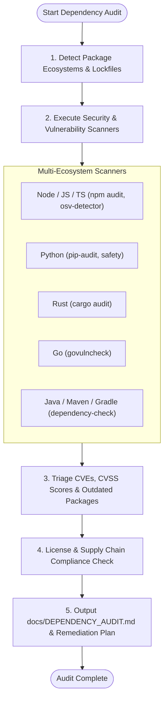

# Dependency & Supply Chain Audit Skill (`dependency-audit`)

A multi-ecosystem package security and dependency auditor that scans for known CVE vulnerabilities, unmaintained packages, outdated dependencies, and licensing conflicts across your repositories.

---

## Agent Detection & Mode Tuning

| Agent / Environment | Audit Mechanism |
| :--- | :--- |
| **Antigravity (`agy`)** | Runs ecosystem scanners via `run_command`, analyzes lockfiles with `view_file`, and generates interactive security reports (`write_to_file` with `ArtifactMetadata`). |
| **Claude Code** | Parses `$ARGUMENTS` (e.g. `/dependency-audit`, `/dependency-audit --fix`), runs security CLI tools in Bash, and generates remediation scripts. |
| **Cursor (Composer / Agent)** | Scans manifests (`package.json`, `requirements.txt`, `Cargo.toml`), helping update version bounds directly in editor. |
| **Universal AI Agents** | Standard lockfile inspection and cross-referencing against OSV/NVD vulnerability databases. |

---

## Audit Workflow Pipeline



---

## Step 1: Detect Ecosystem & Run Scanners

Identify lockfiles and run the corresponding native security tool:

### Node.js / JavaScript / TypeScript
```bash
# npm
npm audit --json 2>/dev/null || npm audit

# pnpm / yarn
pnpm audit 2>/dev/null || yarn audit 2>/dev/null || true
```

### Python
```bash
# pip-audit (OSV / PyPI database)
uv run pip-audit 2>/dev/null || pip-audit 2>/dev/null || pip list --outdated 2>/dev/null || true
```

### Rust
```bash
cargo audit 2>/dev/null || cargo outdated 2>/dev/null || true
```

### Go
```bash
govulncheck ./... 2>/dev/null || go list -m -u all 2>/dev/null || true
```

### Universal Fallback (OSV Scanner / Trivy)
```bash
osv-scanner -r . 2>/dev/null || trivy fs . 2>/dev/null || true
```

---

## Step 2: CVE Triage & Risk Matrix

Classify all discovered vulnerabilities by severity:

| Severity | CVSS Score | Impact Criteria | Action Window |
| :--- | :---: | :--- | :--- |
| **🚨 CRITICAL** | 9.0 – 10.0 | Remote Code Execution (RCE), unauthenticated bypass, full data exfiltration. | Immediate hotfix / bump. |
| **⚠️ HIGH** | 7.0 – 8.9 | Denial of Service (DoS), privilege escalation, prototype pollution. | Fix in current milestone. |
| **⚡ MEDIUM** | 4.0 – 6.9 | Information disclosure under specific configurations. | Scheduled update. |
| **ℹ️ LOW** | 0.1 – 3.9 | Minor edge cases or theoretical issues. | Regular maintenance. |

---

## Step 3: Outdated & Abandoned Library Analysis

Check for:
1. **Major Version Lag**: Dependencies $>2$ major versions behind upstream (higher risk of future breaking migrations).
2. **Archived / Abandoned Repositories**: Packages with no releases or commits in $>2$ years.
3. **Bloated Direct Dependencies**: Direct dependencies that can be replaced by modern built-in standard library features (e.g. `lodash`, `request`, `moment`).

---

## Step 4: License & Compliance Guardrails

Inspect dependency licenses to detect non-commercial or high-risk copyleft licenses:
- **Permissive (Safe)**: MIT, Apache-2.0, BSD-2-Clause, BSD-3-Clause, ISC, CC0.
- **Weak Copyleft (Review)**: LGPL, MPL-2.0.
- **Strong Copyleft (Risk in Proprietary Code)**: GPL-2.0, GPL-3.0, AGPL-3.0.

---

## Step 5: Generate Report & Remediation

Save the complete evaluation to `docs/DEPENDENCY_AUDIT.md`:

```markdown
# Dependency Security & Supply Chain Audit Report

**Date:** `[YYYY-MM-DD]`  
**Ecosystem:** `[Node.js / Python / Rust / Go]`  
**Total Dependencies Audited:** `[XX]`  
**Security Status:** `[Clean / X Vulnerabilities Detected]`

---

## 1. 🚨 Vulnerability Summary (CVEs)
- **Package:** `axios` (`0.21.1` $\rightarrow$ Fixed in `0.21.2+`)
  - **CVE:** `CVE-2021-3749` (CVSS 7.5 - High)
  - **Vulnerability:** Regular Expression Denial of Service (ReDoS)
  - **Remediation Command:** `npm install axios@latest`

---

## 2. 📦 Outdated Dependencies & Migration Roadmap
| Package | Installed | Latest | SemVer Gap | Recommendation |
| :--- | :---: | :---: | :---: | :--- |
| `express` | 4.18.2 | 4.19.2 | Patch | Safe to update immediately |
| `zod` | 3.20.0 | 3.23.8 | Minor | Safe to update |

---

## 3. 📜 License Compliance Scorecard
- All direct dependencies verified under permissive licenses (MIT, Apache-2.0).
```

---

## Remediation Golden Rules

1. **Test After Updating**: Always execute the full test suite after bumping package versions.
2. **Avoid Blind `--force`**: Never use `npm audit fix --force` without reviewing breaking major version migrations.
3. **Pin Lockfiles**: Ensure lockfiles (`package-lock.json`, `poetry.lock`, `Cargo.lock`) are committed to version control.
