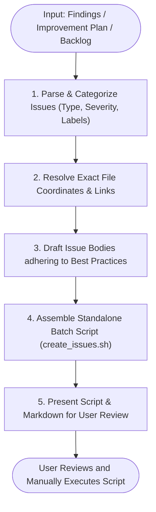

# GitHub Issues Script Generator Skill

An agent skill to transform code review findings, architectural debt, security vulnerabilities, or task backlogs into a standalone, human-reviewable executable script (e.g. `scripts/create_issues.sh`) that automates creating production-quality GitHub issues via the GitHub CLI (`gh`).

For general findings-to-issues work, prefer `drafting-issue-reports`, which verifies each claim and dedupes against existing issues before filing. Use this skill when findings already carry exact file:line coordinates and the fuller, code-block-heavy template below fits the material.

---

## Agent Detection & Mode Tuning

Detect the active runtime environment. See `references/AGENT_TUNING.md` for tool selection and output conventions.

---

## Issue Quality & Anatomy Best Practices

Every generated issue must adhere to industry-standard GitHub issue formatting:

```markdown
### 📋 Summary & Nature of Issue
Concise description of the problem, architectural smell, bug, or technical debt.

### 📍 Coordinates & Location
- **File:** [`src/core/auth/session.ts`](file:///absolute/path/or/relative/path)
- **Lines:** `L45-L89`
- **Git Permalink / Target Component:** `Core Auth Module (SessionStore)`

### ⚠️ Why It's a Problem (Impact & Risk)
- **Root Cause:** Explanation of why the code is structured poorly or failing.
- **Blast Radius:** Modules or user flows affected.
- **Technical / Security Impact:** Performance degradation, memory leaks, security vulnerability, or maintenance blocker.

### 🛠️ Recommended Remediation
Step-by-step actionable guide or code transformation to resolve the issue:
```language
// ❌ Before
...
// ✅ Recommended Fix
...
```

### 🔗 References & Assets
- Documentation, ADR links, or related issues.
```

---

## Workflow Steps



---

## Step 1: Ingest & Categorize Findings

Ingest findings from:
1. An existing improvement plan (e.g. `docs/ARCHITECTURE_REVIEW.md`, `.planning/reviews/`, `BACKLOG.md`)
2. Output from `/code-architecture-review`, `/security-scan`, or test suite
3. Direct user prompt / conversational instructions

For each finding, extract:
- **Title**: Prefixed with a standardized type tag:
  - `[Arch]` - Architectural refactoring / decoupling
  - `[Bug]` - Logic error / runtime defect
  - `[Perf]` - Performance / bottleneck / memory leak
  - `[Security]` - Vulnerability / authorization / validation flaw
  - `[Debt]` - Code smell / typing / maintainability cleanup
  - `[Docs]` - Documentation / specification gap
- **Priority**: `P0` (Critical), `P1` (High), `P2` (Medium), `P3` (Low / Polish)
- **Labels**: e.g., `["architecture", "refactor", "priority:p1"]`
- **Milestone / Project** (Optional)

---

## Step 2: Resolve File Coordinates & Links

Ensure every issue contains exact, verifiable file coordinates:
- Check that the target file exists in the repository.
- Pinpoint specific line ranges (e.g. `src/services/order.ts#L45-L62`).
- Include GitHub-compatible markdown links or relative repository paths.

---

## Step 3: Generate the Standalone Batch Script

Write the batch script to `scripts/create_issues.sh` (or custom path requested by the user).

### Script Requirements:
1. **Safety First**: Must support `--dry-run` to preview all issues without creating them.
2. **Pre-flight Checks**:
   - Verifies `gh` CLI is installed (`command -v gh`).
   - Verifies GitHub authentication (`gh auth status`).
   - Detects the current repository or accepts `--repo owner/name`.
3. **Escaping Integrity**: Uses quoted EOF heredocs (`cat << 'EOF'`) to completely eliminate shell variable expansion and backtick corruption.
4. **Interactive Mode**: Prompts user before each issue or allows batch mode (`--yes` / `--all`).

---

## Reference Template for `scripts/create_issues.sh`

Generate the batch creator script using the reference implementation in `references/CREATE_ISSUES_TEMPLATE.sh`.

Key script features:
- **`--dry-run` flag:** Previews all issue titles and formatted bodies without hitting GitHub API.
- **Interactive prompts:** Asks `[y/N/q]` per issue unless invoked with `--all` / `-y`.
- **Pre-flight checks:** Validates `gh` CLI presence and `gh auth status` authentication.
- **Quoted heredocs:** Wraps each issue body in `read -r -d '' BODY << 'EOF'` to protect backticks and code snippets.
- **Standard issue anatomy:** Uses markdown sections per `templates/issue_template.md`.

---

## Anti-Patterns to Avoid

1. **Vague Titles**: Never create issues titled `"Fix bug"` or `"Refactor code"`. Always use component-scoped, descriptive titles.
2. **Missing Coordinates**: Never omit exact file paths or line numbers. Reviewers and contributors must know immediately where to look.
3. **No Dry Run**: Never generate a script that executes network mutations without giving the user a chance to inspect or run `--dry-run`.
4. **Shell Quoting Vulnerabilities**: Never use double-quoted strings for multi-line markdown containing code blocks (`$`, backticks, double quotes). Always use quoted heredocs (`<< 'EOF'`).
