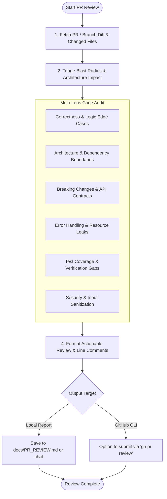

# Pull Request & Diff Review Skill (`pr-review`)

A specialized code review skill for analyzing pull requests, feature branches, and git diffs before merging. Pinpoints regressions, architectural drift, breaking API contracts, security flaws, and test coverage gaps.

---

## Agent Detection & Mode Tuning

| Agent / Environment | PR Review Mechanism |
| :--- | :--- |
| **Antigravity (`agy`)** | Inspects git diffs via `run_command` or GitHub CLI (`gh pr diff`), analyzes changed files with `view_file`, and generates interactive review artifacts (`write_to_file` with `ArtifactMetadata`). |
| **Claude Code** | Parses `$ARGUMENTS` (e.g. `/pr-review`, `/pr-review 42`, `/pr-review feature-branch`), queries `gh pr diff`, and outputs structured markdown feedback. |
| **Cursor (Composer / Agent)** | Reviews staged changes or branch diffs against `main`, highlighting inline suggestions compatible with Cursor's multi-file editor. |
| **Universal AI Agents** | Standard git diff inspection (`git diff origin/main...HEAD`) with markdown reporting. |

---

## PR Review Workflow



---

## Step 1: Fetch Diff & Context

Detect whether reviewing a PR number, branch, or local uncommitted diff:

```bash
# Case A: GitHub PR by number (e.g. PR #42)
gh pr diff 42 --color=never > /tmp/pr_diff.patch 2>/dev/null || true
gh pr view 42 --json title,body,author,baseRefName,headRefName 2>/dev/null || true

# Case B: Local feature branch compared to main/master
git diff $(git merge-base HEAD origin/main 2>/dev/null || git merge-base HEAD origin/master 2>/dev/null || echo "HEAD~1")...HEAD > /tmp/pr_diff.patch

# Case C: Staged or uncommitted working tree changes
git diff --staged > /tmp/pr_diff.patch
```

List all modified files to understand the blast radius:
```bash
git diff --stat
```

---

## Step 2: Multi-Lens Review Matrix

Evaluate the diff across 6 critical dimensions:

| Lens | Focus Areas | What to Flag |
| :--- | :--- | :--- |
| **1. Correctness & Logic** | Edge cases, null/undefined safety, race conditions, off-by-one errors. | Unchecked optional chaining, missing default cases, unhandled async promise rejections. |
| **2. Architecture & Design** | SRP, layer boundaries, dependency direction, circular imports. | UI component calling DB directly, domain logic leaking into controllers, new tight couplings. |
| **3. Breaking Changes** | Public API signatures, database schema changes, serialized formats. | Renamed JSON fields, modified function signatures without fallback, non-additive DB migrations. |
| **4. Error Handling & Observability** | Silent failures, broad `catch` blocks, missing structured logs. | Empty `catch(e) {}` / `except: pass`, swallowed error context, missing logging on failure paths. |
| **5. Test Coverage** | New features or bugfixes missing corresponding unit/integration tests. | Modified core logic with zero test updates, untested conditional branches. |
| **6. Security & Trust Boundaries** | Injection vulnerabilities, auth checks, hardcoded secrets, untrusted inputs. | Raw SQL concatenation, shell execution of user input, exposed API keys or tokens. |

---

## Step 3: Structured Review Output

Produce a structured markdown review. If appropriate, write to `docs/PR_REVIEW.md` or submit to GitHub:

```markdown
# Pull Request Review: [PR Title / Branch]

**Review Verdict:** `[APPROVE | REQUEST_CHANGES | COMMENT]`  
**Risk Level:** `[Low | Medium | High | Critical]`  
**Summary:** Brief executive summary of the changes and overall quality.

---

### 🚨 Blocking Issues (Must Fix Before Merge)
- [ ] **[Issue 1 Title]**
  - **Location:** `path/to/file.ext#L45-L52`
  - **Concern:** Description of why this is a blocker (bug, security risk, or breaking change).
  - **Suggested Fix:**
    ```language
    // Proposed solution snippet
    ```

---

### 💡 Non-Blocking Suggestions (Improvements & Polish)
- [ ] **[Suggestion Title]**: `path/to/file.ext#L12` - Description of optimization or readability cleanup.

---

### 🧪 Test & Verification Assessment
- **Existing Tests:** Passes / Fails
- **Missing Test Scenarios:** Explicit list of edge cases that require new tests before merging.

---

### 🛡️ Security & Breaking Change Assessment
- **Breaking API Changes:** None / Detected: `[Details]`
- **Security Implications:** Clean / Flagged: `[Details]`
```

---

## Step 4: Submitting via GitHub CLI (`gh`)

When the user requests submitting the review directly to GitHub:

```bash
# Submit review with comments
gh pr review <PR_NUMBER> --approve --body "LGTM! Approved with minor suggestions."
# Or request changes:
gh pr review <PR_NUMBER> --request-changes --body "<Review Markdown>"
# Or general comment:
gh pr review <PR_NUMBER> --comment --body "<Review Markdown>"
```

---

## Review Anti-Patterns

1. **Do NOT nitpick pure style/formatting**: Rely on linters/Prettier. Focus on architecture, correctness, security, and edge cases.
2. **Do NOT approve without verifying tests**: If core logic changed without tests, explicitly request tests.
3. **Always provide constructive code examples**: Show how to fix the issue rather than only pointing out what is wrong.
