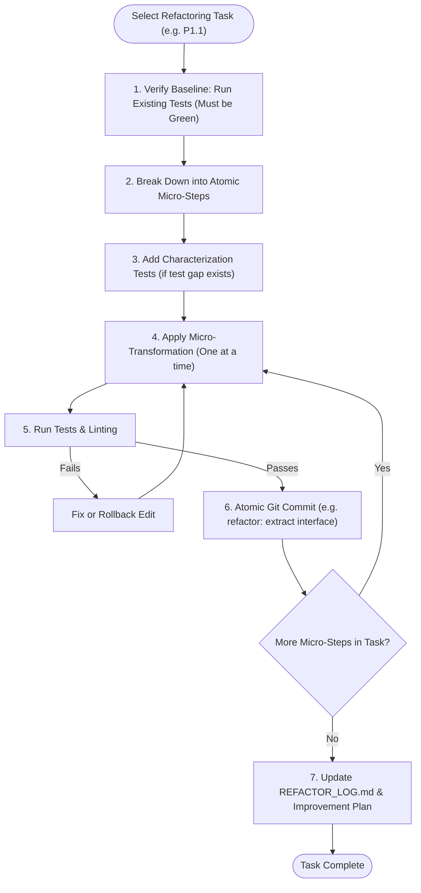

# Safe Refactoring Execution Skill (`refactor-execute`)

An agent skill designed to turn complex architectural refactoring plans (e.g., from `ARCHITECTURE_REVIEW.md` Phase P0/P1/P2) into safe, incremental, and verified code transformations without breaking existing functionality.

---

## Agent Detection & Mode Tuning

| Agent / Environment | Refactoring Execution Workflow |
| :--- | :--- |
| **Antigravity (`agy`)** | Uses `replace_file_content` / `write_to_file` for precise edits, runs tests with `run_command`, creates atomic git commits, and updates interactive tracking logs. |
| **Claude Code** | Parses `$ARGUMENTS` (e.g. `/refactor-execute P0.1` or `/refactor-execute docs/ARCHITECTURE_REVIEW.md`), executes step-by-step edits with tool calling, runs tests via Bash. |
| **Cursor (Composer / Agent)** | Applies multi-file edits with Composer, verifying terminal test runs between steps. |
| **Universal AI Agents** | Executes standard atomic refactoring recipes with automated test verification after every micro-step. |

---

## The 7-Step Invariant Refactoring Loop



---

## Step 1: Pre-Flight Baseline & Verification

Before modifying any production code:

1. **Check Git Status**: Ensure working tree is clean.
   ```bash
   git status --short
   ```
2. **Run Test Suite**:
   ```bash
   # Run project tests (e.g., npm test, pytest, cargo test, go test ./...)
   npm test 2>/dev/null || pytest 2>/dev/null || cargo test 2>/dev/null || go test ./... 2>/dev/null || true
   ```
   > [!IMPORTANT]
   > If baseline tests fail *before* refactoring, **STOP** and resolve or flag existing failures first. Never refactor against broken tests.

3. **Characterization Tests**: If the code to be refactored lacks test coverage, write unit tests locking in current observable behavior before modifying the implementation.

---

## Step 2: Atomic Refactoring Recipes

Follow proven Martin Fowler refactoring patterns:

### Recipe A: Extract Interface & Invert Dependency
1. Declare interface / port alongside domain model.
2. Update consumer class constructor to accept interface rather than concrete instance.
3. Pass concrete implementation via factory or composition root.
4. Verify tests pass and commit.

### Recipe B: Break Down God Object / Mega-Method
1. Identify cohesive clusters of fields/methods.
2. Use **Extract Method** on small subsections.
3. Use **Extract Class / Service** for grouped behavior.
4. Delegate from original class to new service (preserve backward compatibility).
5. Mark old methods `@deprecated` if part of public API, or remove if internal.

### Recipe C: Replace Conditional / Switch with Strategy
1. Define Strategy interface with execute method.
2. Implement concrete Strategy classes for each `case` branch.
3. Create a strategy map or registry factory.
4. Replace giant `switch` with `strategyRegistry.get(type).execute()`.

---

## Step 3: Atomic Commits & Invariant Validation

Every micro-step must be committed separately with conventional commit messages:

```bash
# Example atomic commit sequence for one refactoring task:
git commit -m "test(order): add characterization tests for discount calculation"
git commit -m "refactor(order): extract IDiscountStrategy interface"
git commit -m "refactor(order): implement VolumeDiscountStrategy"
git commit -m "refactor(order): inject discount strategy into OrderService"
git commit -m "chore(order): remove legacy discount switch block"
```

---

## Step 4: Update Documentation & Refactor Log

Record completed progress in `docs/REFACTOR_LOG.md`:

```markdown
### [YYYY-MM-DD] Refactoring Task: P1.1 - Decouple OrderService
- **Target File:** `src/services/order.ts`
- **Pattern Applied:** Dependency Inversion & Strategy Pattern
- **Commits:** `a1b2c3d`, `e4f5g6h`
- **Verification:** 14 unit tests passing, zero regression.
- **Status:** ✅ Complete
```

---

## Refactoring Golden Rules

1. **Refactoring does NOT change behavior**: If you are adding a new feature or fixing a bug simultaneously, split it into two distinct commits.
2. **Never break the build mid-step**: Keep the code compilable and tests passing at every single commit.
3. **Use Deprecation Bridges for Public APIs**: If callers outside this repo use the function, leave a forwarding shim marked `@deprecated` before removing.
