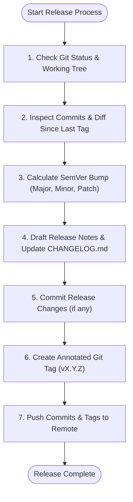

# Release & Semantic Versioning Skill

An automated, intelligent release workflow skill that calculates Semantic Versioning (SemVer 2.0.0) bumps based on code change significance, updates `CHANGELOG.md`, crafts structured commit/tag messages, and safely pushes to git remotes.

---

## Agent Detection & Mode Tuning

| Agent / Environment | Capabilities & Best Practices |
| :--- | :--- |
| **Antigravity (`agy`)** | Run commands via `run_command`, view files via `view_file`, display interactive artifacts for release notes review with `write_to_file`. |
| **Claude Code** | Parse `$ARGUMENTS` (e.g. `/release`, `/release patch`, `/release minor`, `/release major`, `/release --dry-run`), run git commands inline in Bash. |
| **Cursor (Composer / Agent)** | Run terminal commands, update `CHANGELOG.md` in-editor, prompt user before pushing to remote. |
| **Universal AI Agents** | Execute portable shell commands and follow strict SemVer 2.0.0 guidelines. |

---

## Release Workflow Pipeline



---

## Step 1: Check Working Tree & Previous Tags

Inspect the repository state:

```bash
# 1. Check current branch and uncommitted changes
git status --short

# 2. Get latest SemVer tag (or fallback to empty if initial release)
LATEST_TAG=$(git describe --tags --abbrev=0 2>/dev/null || echo "")

# 3. Check configured remotes
git remote -v
```

- If there are uncommitted changes, categorize them into whether they belong in the release commit or need user alignment.
- If no tags exist in the repository, the baseline version starts at `v0.1.0` (or `v1.0.0` if production-ready).

---

## Step 2: Analyze Commit Significance & Calculate SemVer

Inspect all commits and file diffs since `$LATEST_TAG` (or since repository root if no prior tag):

```bash
if [ -n "$LATEST_TAG" ]; then
    COMMIT_RANGE="${LATEST_TAG}..HEAD"
else
    COMMIT_RANGE="HEAD"
fi

# Review commit logs
git log "$COMMIT_RANGE" --oneline --no-merges

# Review changed files and diff summary
git diff "$COMMIT_RANGE" --stat
```

### SemVer Bump Evaluation Rules (SemVer 2.0.0):

| Change Category | Impact Criteria | Version Bump | Example |
| :--- | :--- | :---: | :--- |
| **MAJOR (`X.0.0`)** | Breaking changes, removed public APIs, incompatible config changes, major architectural redesigns. | `X+1.0.0` (or `0.X+1.0` if in zero-ver `v0.y.z`) | `feat!: remove deprecated api`, `BREAKING CHANGE:` |
| **MINOR (`0.X.0`)** | New backward-compatible features, new skills, substantial capabilities added, significant enhancement. | `X.Y+1.0` | `feat: add universal installer script`, `feat: add code review skill` |
| **PATCH (`0.0.X`)** | Backward-compatible bug fixes, documentation updates, internal refactorings, script tweaks, performance optimizations. | `X.Y.Z+1` | `fix: handle edge case in parser`, `docs: update readme` |

*Note: In `v0.x.x` pre-release phase, breaking changes may increment minor version (`v0.1.0` -> `v0.2.0`) and features/fixes increment patch or minor depending on scope.*

---

## Step 3: Update `CHANGELOG.md`

Maintain a standard `CHANGELOG.md` adhering to [Keep a Changelog](https://keepachangelog.com/):

```markdown
## [vX.Y.Z] - YYYY-MM-DD

### Added
- Feature 1 description
- New skill or capability

### Changed
- Refactored components or workflows

### Fixed
- Bug fixes and error handling corrections

### Security
- Security patches and dependency updates
```

If `CHANGELOG.md` does not exist, create it with the project header and first release entry.

---

## Step 4: Commit & Create Annotated Tag

Execute atomic release steps:

```bash
# 1. Stage and commit CHANGELOG.md (and any version files)
git add CHANGELOG.md
git commit -m "chore(release): bump version to vX.Y.Z" || true

# 2. Create annotated tag with release summary
git tag -a "vX.Y.Z" -m "Release vX.Y.Z

- Summary of key features and changes included in this release."
```

---

## Step 5: Push Commits & Tags to Remote

**Confirm first.** A push is outward-facing and hard to undo. Show the remote, branch, and tag about to be pushed, and wait for an explicit yes. Invoking `/release` or `/swe release` is not consent to push. Without a yes, stop after the local tag and give the push commands.

Verify remote configuration:

```bash
# Check if remote exists
REMOTE_NAME=$(git remote | head -n 1)

if [ -n "$REMOTE_NAME" ]; then
    CURRENT_BRANCH=$(git rev-parse --abbrev-ref HEAD)
    echo "Pushing commits and tags to $REMOTE_NAME ($CURRENT_BRANCH)..."
    git push "$REMOTE_NAME" "$CURRENT_BRANCH"
    git push "$REMOTE_NAME" --tags
    echo "✓ Successfully pushed release to $REMOTE_NAME"
else
    echo "⚠ No git remote configured. Tags and commits created locally."
    echo "  To push later, add a remote: git remote add origin <url>"
    echo "  Then run: git push -u origin main --tags"
fi
```

---

## Step 6: Helper Script Execution

For automated release execution, agents and users can run the companion script:
The script asks before pushing when it has a terminal, and skips the push (printing the commands) when it does not. `--yes` pushes without asking, so an agent passes it only after the user has confirmed the push. Run `--dry-run` first.

```bash
# Run automated release helper
./skills/release/scripts/release.sh

# Or with specific bump override:
./skills/release/scripts/release.sh --minor
./skills/release/scripts/release.sh --patch
./skills/release/scripts/release.sh --major
./skills/release/scripts/release.sh --dry-run
./skills/release/scripts/release.sh --yes    # push without prompting (after user confirmation)
```

---

## Best Practices & Anti-Patterns

1. **Always use annotated tags** (`git tag -a`), never lightweight unannotated tags for releases.
2. **Never push with `--force`** when releasing tags.
3. **Verify clean builds/tests** before tagging if a test suite is present.
4. **Gracefully handle missing remotes** without aborting local tag creation.
