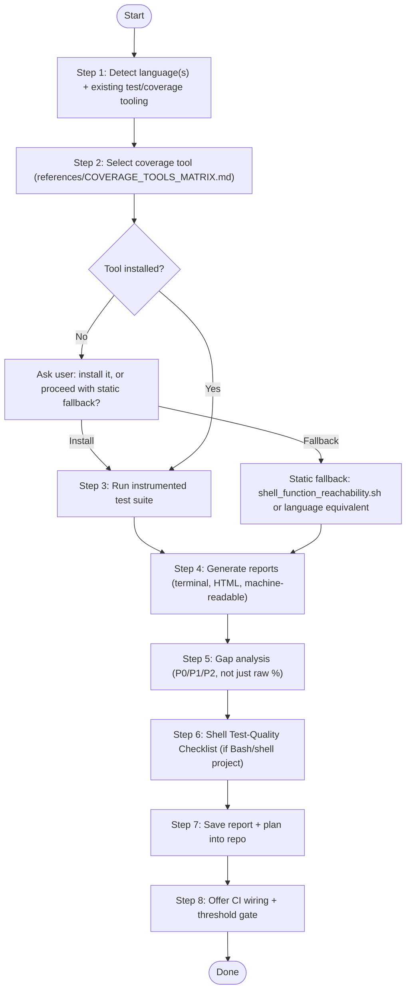

# Test Coverage & Suite Robustness Skill

Audits an existing test suite, measures real coverage (not just "tests pass"), and produces a prioritized, saved-to-repo plan for closing the gaps that matter most — critical/security paths first, raw percentage last.

**Core principle:** a coverage percentage is a proxy, not the goal. A codebase at 95% line coverage with every external command unmocked and every dispatch table silently no-op-ing on bad input is less safe than one at 70% that has deliberately targeted the failure modes that actually bite. This skill treats percentage as one input among several, not the deliverable.

---

## Agent Detection & Mode Tuning

| Agent / Environment | Primary Capabilities & Output Mechanism |
| :--- | :--- |
| **Claude Code** | Use `Read`, `Grep`, `Glob`, `Bash`. Invoke via `/test-coverage`, parse `$ARGUMENTS` for a scoped path. Run coverage tools inline; stream progress concisely. |
| **Antigravity (`agy`)** | Use native file/search tools. Run coverage commands via `run_command`. Render the coverage summary as an interactive artifact with `write_to_file`. |
| **Cursor (Composer / Agent)** | Run terminal commands for the detected tool, reference `@<coverage-report-path>` in Composer for follow-up work. |
| **Universal / CLI Agents** | Use POSIX tools; fall back to `references/COVERAGE_TOOLS_MATRIX.md` and the reachability script when no coverage tool is installed and network/package installation isn't available or approved. |

---

## Workflow Overview



---

## Step 1: Detect Language(s) & Existing Tooling

```bash
# Manifest-based detection
ls package.json pyproject.toml go.mod Cargo.toml pom.xml build.gradle Gemfile *.csproj composer.json 2>/dev/null

# Shell/Bash project signal
find . -maxdepth 3 -name "*.bats" -o -name "run_tests.sh" 2>/dev/null | head -5
grep -l "^#!/usr/bin/env bash\|^#!/bin/bash" ./* 2>/dev/null | head -5
```

Also check for tooling **already configured** before introducing anything new:
```bash
grep -rn "coverage\|kcov\|nyc\|c8\|pytest-cov\|tarpaulin\|jacoco\|coverlet" package.json pyproject.toml Makefile .github/workflows/*.yml 2>/dev/null
```
If coverage tooling is already wired into CI, use that exact invocation rather than introducing a second, competing one.

---

## Step 2: Select the Coverage Tool

Consult `references/COVERAGE_TOOLS_MATRIX.md` for the language detected. For **Bash/shell projects specifically**, read `references/BASH_COVERAGE_NOTES.md` before running anything — it documents empirically-verified kcov+bats-core failure modes (runaway recursive trap output, silently-zero coverage from `--include-path`, and per-file misattribution through `source`) and the exact flags that avoid them. Don't rediscover these the hard way.

### Installation gate

If the selected tool isn't installed, **ask the user** before installing (package managers touch the host):
> *"`<tool>` isn't installed. Install it via `<brew/apt/pip/npm command>`, or proceed with the static reachability fallback (zero install, works everywhere, coarser signal)?"*

---

## Step 3: Run the Instrumented Suite

### Non-shell languages
Use the matrix's documented invocation, e.g.:
```bash
pytest --cov=<package> --cov-report=term-missing --cov-report=html --cov-report=xml
vitest run --coverage
go test -coverprofile=coverage.out ./... && go tool cover -func=coverage.out
cargo llvm-cov --html
```

### Shell/Bash projects (bats-core)
```bash
# Direct CLI-invocation coverage (reliable) — repeat per representative invocation:
kcov --exclude-pattern=/opt/homebrew,/usr/lib,/System,/usr/local/Cellar out/ ./<entrypoint> --help
kcov --exclude-pattern=/opt/homebrew,/usr/lib,/System,/usr/local/Cellar out/ ./<entrypoint> <representative-subcommand>

# Aggregate best-effort bats run (per BASH_COVERAGE_NOTES.md — no --include-path):
kcov --exclude-pattern=<bats-install-dir>,/usr/lib,/System out/ bats tests/unit tests/integration

# Deterministic floor-level signal (always run this one, regardless of kcov's result):
scripts/shell_function_reachability.sh lib <entrypoint> -- tests/unit tests/integration
```
Run the reachability script unconditionally, even when kcov works cleanly — it catches a different failure mode (a function referenced by name in a test but whose real logic is mocked away entirely) that instrumented coverage can't see.

---

## Step 4: Generate & Save Reports

Produce, in this order of usefulness:
1. **Terminal summary** — shown to the user immediately.
2. **Machine-readable** (lcov/cobertura/JSON) — for CI gating and tooling.
3. **HTML** — for human deep-dives, saved as a build artifact (don't commit generated HTML to the repo; add its output dir to `.gitignore`).

The **written report** (Markdown, committed to the repo) is `templates/COVERAGE_REPORT_TEMPLATE.md` filled in — this is the actual deliverable, not the raw tool output.

---

## Step 5: Gap Analysis — Beyond the Percentage

For every function/module with zero coverage, classify by what it actually does, not just that it's untested:

| Priority | Criteria |
|---|---|
| **P0** | Touches auth, credentials, command construction from user/external input, network egress, privilege boundaries, or destructive operations (delete/rm/force/overwrite). Untested here is a security or data-loss risk, not just a quality gap. |
| **P1** | Core "does the thing actually work" execution paths — e.g. the real backend/driver logic, not its pure-text-generation helpers. If this breaks, the tool doesn't work; nothing else catches it. |
| **P2** | Error-handling/edge-case branches in code that IS otherwise tested on the happy path. |

Don't stop at "X% covered" — name the specific functions and explain the concrete failure scenario if they break silently.

---

## Step 6: Shell Test-Quality Checklist

Apply this whenever the target includes Bash/shell code, regardless of coverage tool availability — these are correctness bugs that raw percentage won't surface even at 100%:

1. **`set -e` interaction check.** bats-core does NOT run test bodies under `set -e`, but a real CLI entrypoint sourcing these library files typically does (`set -euo pipefail` at the top). A bare `[[ cond ]] && cmd` or `cmd1 || cmd2` used as a function's or loop's *final* statement silently returns the condition's exit code — under `-e`, this can abort the entire real process the moment the "everything's fine" branch is hit, while the exact same code sails through bats untested (bats doesn't run under `-e`, so this class of bug is invisible to it). Verify by running the suspect function in a real `bash -euo pipefail -c '...; echo REACHED_END'` subshell and asserting `REACHED_END` actually prints. This is not theoretical — it was found twice in two different functions during the session that produced this skill, both times only by this specific test technique, never by inspection.
2. **External-command mocking.** Every function that shells out to docker/podman/ssh/cloud CLIs/hypervisor managers needs at least one test where that binary is a fake script on `PATH` (`PATH="$fake_bin_dir:$PATH"`) recording its invocation and returning canned output — not just a `command -v docker || skip`. Skipping when the tool's absent means CI (which usually lacks these tools) never runs the logic at all.
3. **Command-string injection check.** Anywhere a variable is spliced into a command *string* that's later handed to a shell (`ssh host "$cmd"`, `eval "$x"`) rather than passed as a separate argv element, add a test with shell metacharacters (`; touch pwned`, `` `id` ``) in that variable and assert nothing unintended happens. Contrast with argv-array invocation (`cmd_array+=("$var")`), which is immune by construction and doesn't need this test.
4. **Dispatch-table completeness.** Every `case "$mode" in a|b|c) ...; esac` that maps an enum-like value to behavior should have a companion test asserting an unrecognized value fails loudly (`*) die ...`) — not silently falls through and does nothing. A dispatch table with no default case is a silent-no-op waiting to happen the moment a new valid-looking-but-untested value reaches it.

---

## Step 7: Save the Report

Write the filled-in `templates/COVERAGE_REPORT_TEMPLATE.md` to:
- `docs/TEST_COVERAGE.md` (preferred if `docs/` exists), or
- `.planning/research/TEST_COVERAGE_<date>.md` (GSD/planning-structured projects), or
- `TEST_COVERAGE.md` at repo root otherwise.

If a prior coverage report exists at that path, don't silently overwrite — diff against it and note what changed (regressions vs. improvements) in the new version.

---

## Step 8: Offer CI Wiring

Propose (don't apply without confirmation unless already asked to make the suite "more robust" end-to-end):
1. A CI job running the coverage tool and uploading the HTML/lcov artifact.
2. A **threshold gate** — prefer "don't regress below current baseline" over an arbitrary target percentage picked without context.
3. For Bash projects: wire `shell_function_reachability.sh` as a blocking check (it's deterministic, fast, and has no tool-version sensitivity) even if instrumented kcov coverage is only best-effort/non-blocking due to the caveats in `BASH_COVERAGE_NOTES.md`.

---

## Anti-Patterns to Avoid

1. **Do NOT treat a raw percentage as the deliverable.** A number with no gap analysis or prioritization is not actionable.
2. **Do NOT claim instrumented coverage works when it doesn't.** If kcov+bats produces a report attributing everything to a bats temp file (see `BASH_COVERAGE_NOTES.md`), say so and lean on the reachability script instead of reporting a misleading number.
3. **Do NOT skip a function's tests just because the required external tool isn't installed in this environment.** Mock it instead — that's the whole point of the External-command mocking checklist item.
4. **Do NOT install packages/tools without asking first** (matches the pattern in `code-architecture-review`'s Graphify gate).
5. **Do NOT silently overwrite an existing coverage report** — diff and note deltas.
6. **Do NOT stop at "tests pass."** A suite that passes 100% of its tests while never exercising the riskiest code paths (per Step 5's P0/P1 classification) is not robust, regardless of the percentage.
